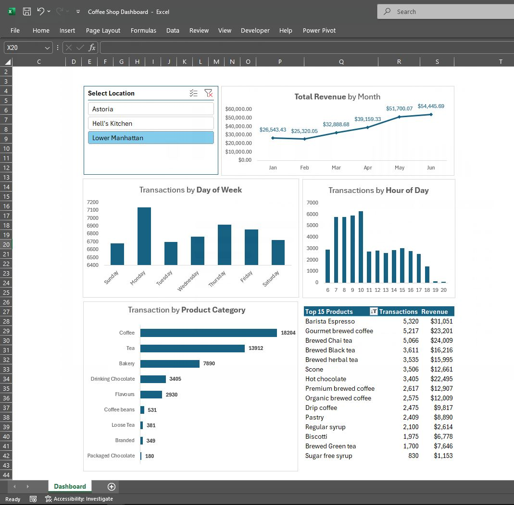
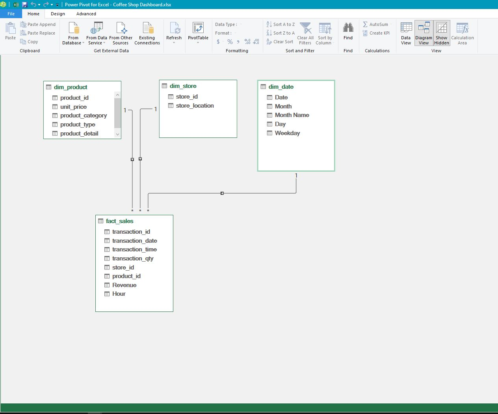

# Coffee Shop Sales – Excel Data Modeling

**Transform flat file into relational star schema using Power Query & Power Pivot**

---

## 📌 Project Overview

This project demonstrates **proper data modeling techniques in Excel** – not just formulas and pivot tables.

**The Challenge:** Raw data came as a single flat Excel file with transactions, products, and store information all in one sheet.

**What I Did:**
- Separated flat file into **fact and dimension tables** (star schema)
- Removed duplicates from dimension tables for **data integrity**
- Created **relationships** using Power Pivot data model
- Built calculated fields (**Revenue = Quantity × Price**)
- Created **date dimension** with weekday/month names using Excel formulas
- Loaded everything into **data model** – handling 1M+ rows

**Tools Used:** Excel, Power Query, Power Pivot, DAX

---

## 🖼️ Dashboard Preview

*Sample dashboard showing revenue trends, top products, and transaction patterns*

---

## 💡 Trivia: Why Segment Flat Files into Fact & Dimension Tables?

**The Problem with Flat Files:**

| Problem | Example |
|---------|---------|
| Duplicate data | Product name repeats 10,000+ times |
| Data inconsistency | "Coffee" vs "coffee" vs "Cofee" |
| Wasted storage | Massive file size |
| Slow performance | VLOOKUP scans thousands of rows |
| Hard to maintain | Update product name in 10,000 rows |

**The Solution – Star Schema:**

| Benefit | What It Means |
|---------|----------------|
| One source of truth | Update once, everywhere |
| Smaller file size | No duplicate data |
| Faster calculations | Relationships, not VLOOKUP |
| Cleaner structure | Business logic separated |
| Scalable | Fact table grows; dimensions stay small |

> *"Flat file = one giant closet with everything thrown in. Star schema = organized room with labeled racks."*

---

## 📊 Data Model Structure (Star Schema)

*Power Pivot Diagram View showing relationships between fact_sales, dim_product, dim_store, and dim_date*

**Relationships:**
- `fact_sales[product_id]` → `dim_product[product_id]`
- `fact_sales[store_id]` → `dim_store[store_id]`
- `fact_sales[transaction_date]` → `dim_date[Date]`

---

## 📁 Repository Structure
Excel-DataModeling-CoffeeShop/
├── Coffee Shop Dashboard.xlsx # Main Excel file with Power Pivot model
├── README.md # This file
├── data_modeling_steps.md # Detailed step-by-step documentation
├── flatfile/ # Original raw data folder
│ └── [original flat Excel file]
├── documentation/ # Additional documentation folder
├── Images/ # Screenshots folder
│ ├── dashboard_preview.png
│ ├── data_model_diagram.png
│ ├── before_flatfile.png
│ ├── after_starschema.png
│ └── revenue_by_month.png
└── dim_tables/ # Individual dimension tables
├── dim_date.csv
├── dim_product.csv
├── dim_store.csv
└── fact_sales.csv

---

## 🗂️ Files in This Repository

| File | Description |
|------|-------------|
| `Coffee Shop Dashboard.xlsx` | Main Excel file – contains Power Pivot data model, relationships, and dashboard |
| `dim_date.csv` | Date dimension table (unique dates with month/weekday attributes) |
| `dim_product.csv` | Product dimension table (unique products with categories) |
| `dim_store.csv` | Store dimension table (unique store locations) |
| `fact_sales.csv` | Fact table (transaction-level data with quantity, price, revenue) |
| `flatfile/` | Original raw data before transformation |
| `documentation/` | Additional notes and documentation |
| `Images/` | Screenshots of dashboard and data model |

---

## 🔧 Step-by-Step Process

### Step 1: Load Raw Data into Power Query
Imported flat Excel file containing all transaction data.

### Step 2: Create Dimension Tables

**dim_product** – One row per unique product
- Extracted product columns, removed duplicates on `product_id`
- Saved as `dim_product.csv`

**dim_store** – One row per unique store
- Extracted store columns, removed duplicates on `store_id`
- Saved as `dim_store.csv`

**dim_date** – Date attributes for time analysis
- Created using Excel formulas: `=TEXT()`, `=MONTH()`, `=WEEKDAY()`, `=DAY()`
- Saved as `dim_date.csv`

### Step 3: Create Fact Table

**fact_sales** – Transaction-level data
- Kept transaction columns: `transaction_id`, `date`, `time`, `quantity`, `unit_price`, `store_id`, `product_id`
- **Added calculated Revenue column:** `= quantity × unit_price`
- Saved as `fact_sales.csv`

### Step 4: Load to Data Model (Not Excel Sheets)
Used "Only Create Connection" → "Add to Data Model". Bypasses Excel's 1M row limit.

### Step 5: Create Relationships
Connected fact tables to dimension tables using Power Pivot's Diagram View.

### Step 6: Build Dashboard
Insert PivotTables and PivotCharts connected to the data model. No VLOOKUP needed.

---

## 📈 Sample Dashboard Insights

| Visual | Insight |
|--------|---------|
| Revenue by Month | Sales grew from $26K (Jan) to $54K (Jun) |
| Transactions by Day | Weekends have highest volume |
| Transactions by Hour | Peak: 8-10 AM and 3-5 PM |
| Top Products | Barista Espresso ($31K), Gourmet Coffee ($23K) |

---

## 🛠️ Skills Demonstrated

| Skill | How |
|-------|-----|
| Data Modeling | Star schema (fact & dimension tables) |
| Power Query | ETL, data cleaning, transformation |
| Power Pivot | Relationships, data model |
| Excel Formulas | TEXT(), MONTH(), WEEKDAY(), DAY() |
| Calculated Fields | Revenue = Quantity × Price |
| Scalable Design | Data model handles 1M+ rows |
| File Organization | Separated raw data, dim tables, fact table, documentation |

---

## 🚀 How to Use This Repository

1. Download `Coffee Shop Dashboard.xlsx`
2. Open in Excel
3. Go to **Power Pivot** → **Manage** to see the data model
4. Go to **Diagram View** to see relationships

**Requirements:** Excel 2016 or later (Power Pivot included in Professional Plus)

## 📅 Project Date

May 2026

---

## 🔗 Connect with Me

- **LinkedIn:** [linkedin.com/in/reginaldhigoy](https://www.linkedin.com/in/reginaldhigoy/)
- **GitHub:** [github.com/reginaldhigoy](https://github.com/reginaldhigoy)
- **Email:** reginaldhigoy.dev@gmail.com

---

*This project demonstrates data modeling skills – not business insights.*
